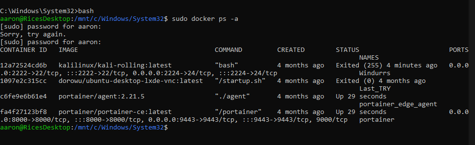
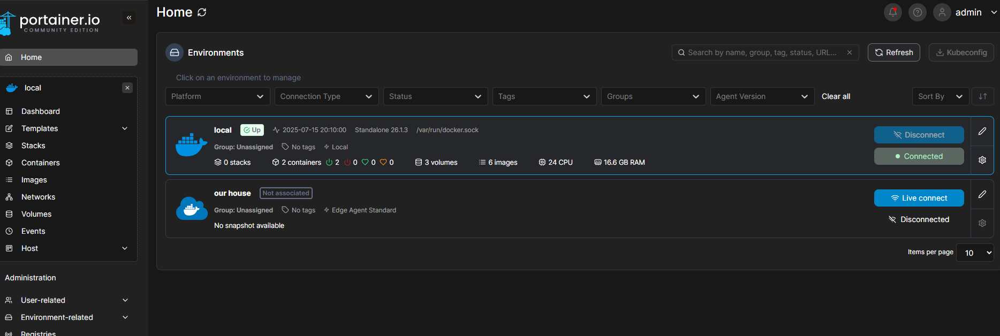
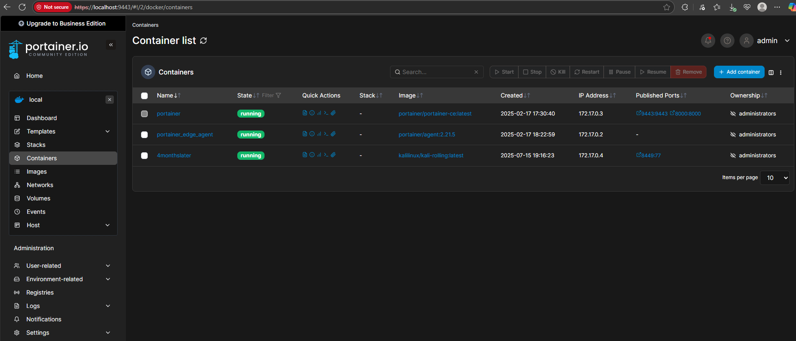
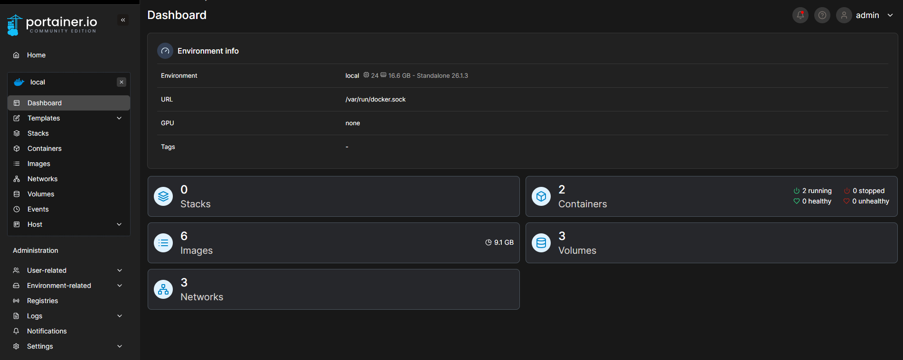
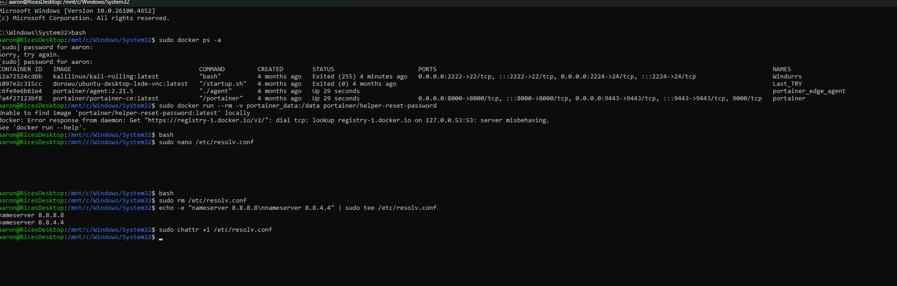

# Doctainer-Lab – Centralized Docker Management

 

## 🎯 Purpose
Lightweight container orchestration environment using Portainer for GUI-based Docker management across multiple hosts, eliminating CLI overhead for complex deployments.

## 🏗️ Architecture
- **Portainer CE** (Community Edition)
- **Docker Engine** (Container runtime)
- **Remote Agents** (Multi-host management)
- **Docker Compose** (Stack orchestration)

## ⚙️ Technical Implementation

### Server Deployment
```bash
# Create persistent volume
docker volume create portainer_data

# Deploy Portainer server
docker run -d -p 9443:9443 -p 8000:8000 \
  --name=portainer \
  --restart=always \
  -v /var/run/docker.sock:/var/run/docker.sock \
  -v portainer_data:/data \
  portainer/portainer-ce
```

### Container Management


### Portainer Dashboard


### Active Containers


### Multi-Host Configuration
```bash
# On remote hosts - install Portainer agent
docker run -d -p 9001:9001 \
  --name portainer_agent \
  --restart=always \
  -v /var/run/docker.sock:/var/run/docker.sock \
  portainer/agent
```

### Environment Dashboard


## 🎯 Key Features
- ✅ Web-based container management
- ✅ Multi-host orchestration
- ✅ Docker Compose stack deployment via GUI
- ✅ Real-time container monitoring
- ✅ Centralized image and volume management

## 📊 Use Cases
- Home lab container management
- Multi-environment testing
- Team collaboration on Docker projects
- Enterprise container visualization
- DevOps workflow simplification

## 🔧 Stack Deployment
Deploy multi-container applications through Portainer GUI:
```yaml
version: '3'
services:
  web:
    image: nginx:alpine
    ports:
      - "80:80"
  db:
    image: postgres:13
    environment:
      POSTGRES_PASSWORD: example
```

**Deploy via:** Portainer GUI → Stacks → Add Stack → Paste YAML → Deploy

## 📈 Technical Highlights
- Agent-based architecture for secure remote management
- Persistent volume integration for data retention
- Web interface eliminating CLI complexity
- Real-time container state monitoring
- Cross-host resource visibility

## 🔒 Security Considerations
- Self-signed SSL certificates for HTTPS
- Docker socket access controls
- Agent authentication and authorization
- Network segmentation support



---

**Built with:** Docker | Portainer | Docker Compose | Linux

**Tags:** `docker` `portainer` `container-orchestration` `devops` `home-lab` `multi-host`
